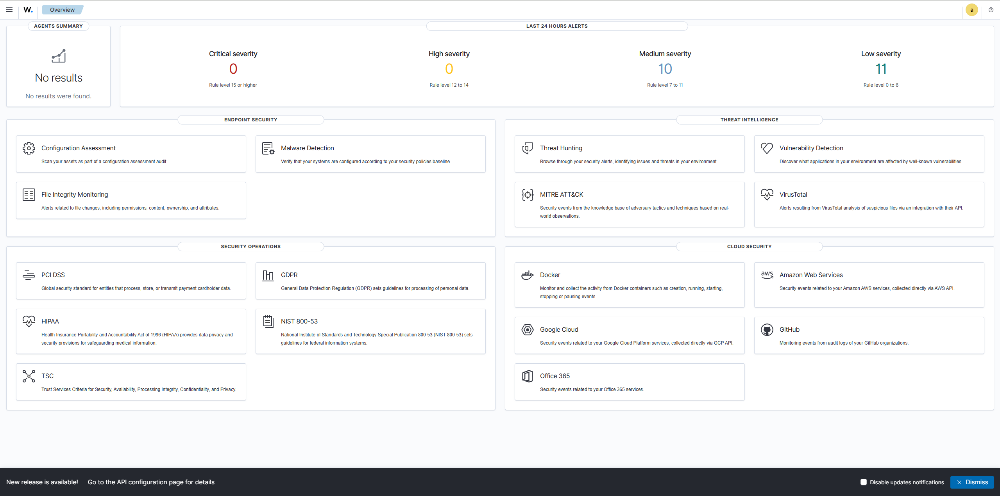
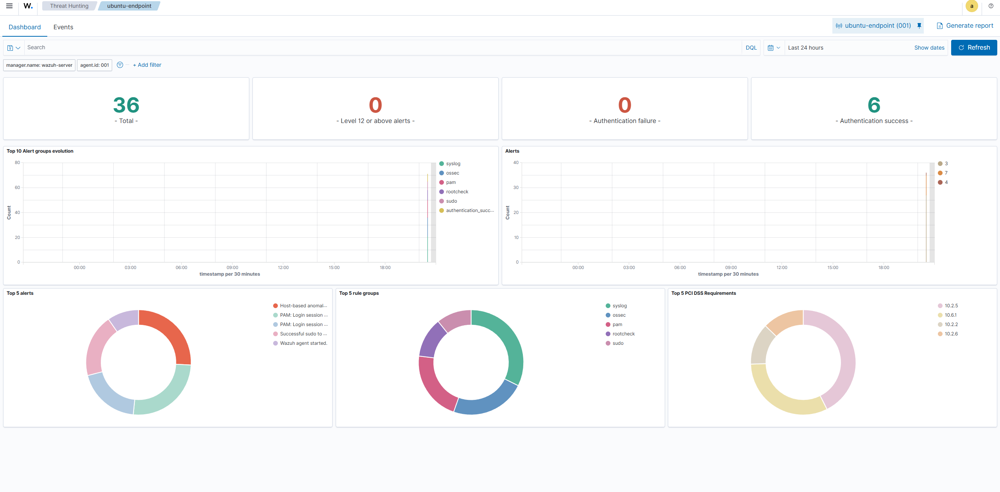
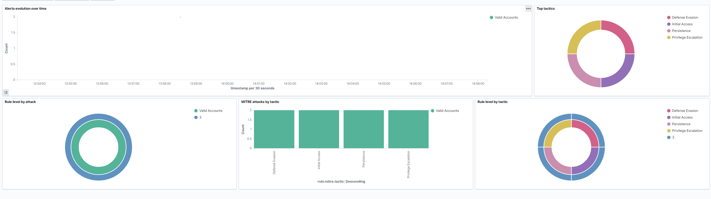
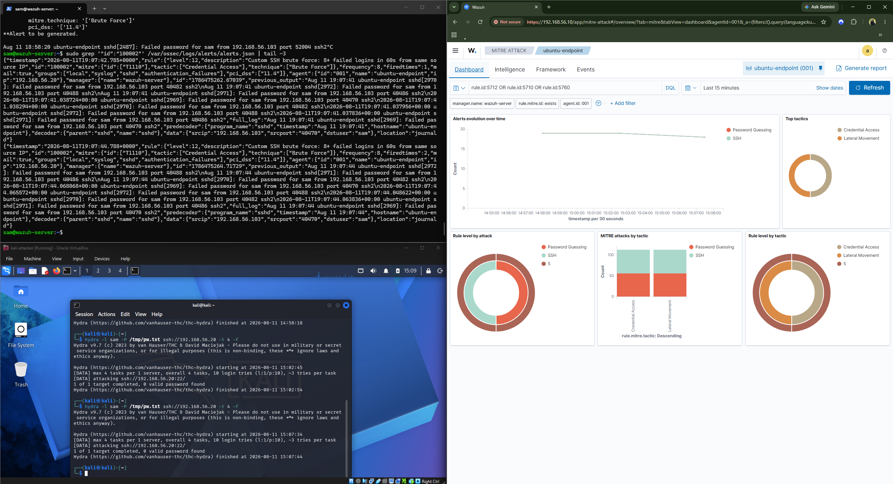

# SOC / SIEM Home Lab

**Status:** 🟢 Core lab complete (M0–M4) — a home Security Operations Center running the full **attack → detect → verify** pipeline that SOC analysts work daily. Stretch goals (Suricata, Active Directory) in progress.

A self-built lab where I monitor endpoints with a SIEM, launch real attacks from an attacker VM, and confirm detections across three layers (endpoint source log → SIEM engine output → dashboard). Built and documented from scratch as hands-on reinforcement of my CompTIA Security+ knowledge.

## Architecture

Four virtual machines on an isolated VirtualBox **host-only** network (`192.168.56.0/24`):

| VM | Role | IP |
|----|------|----|
| Wazuh Server (Ubuntu 24.04) | SIEM — manager, indexer, dashboard | 192.168.56.10 |
| Ubuntu Endpoint | Monitored host (Wazuh agent) | 192.168.56.20 |
| Windows Endpoint | Monitored host (Wazuh agent + Sysmon) | 192.168.56.30 |
| Kali Linux | Attacker | 192.168.56.40 |

## What this lab demonstrates

- **SIEM operations:** deploying Wazuh, enrolling agents, reading and triaging alerts
- **Host-based detection:** Windows Event Logs, Sysmon, Linux auth logs, file integrity
- **Attack simulation:** reconnaissance (Nmap) and exploitation (brute force, Metasploit) from Kali
- **Detection engineering:** writing and tuning custom Wazuh rules
- **Verification discipline:** cross-checking every detection from raw source log → `alerts.json` → dashboard, so alerts are understood, not just trusted

## Tools

`Wazuh` · `Sysmon` · `Kali Linux` · `Nmap` · `Hydra` · `Metasploit` · `Windows Active Directory` (stretch) · `Suricata` (stretch) · `VirtualBox`

## Roadmap

- [x] **M0** — Prep: hypervisor, ISOs, host-only network
- [x] **M1** — Wazuh server up, dashboard reachable
- [x] **M2** — Ubuntu endpoint reporting as a Wazuh agent with live events _(Windows endpoint deferred)_
- [x] **M3** — Attack from Kali (recon + brute force) detected in Wazuh with MITRE ATT&CK correlation
- [x] **M4** — Detection + three-layer verification + one custom rule
- [ ] Stretch — Suricata forwarded into Wazuh (network + host visibility)
- [ ] Stretch — Active Directory domain + domain-attack detection

Full step-by-step build guide: [`SOC Lab - Build Plan.md`](SOC%20Lab%20-%20Build%20Plan.md)

## Progress

### Milestone 1 — Wazuh SIEM deployed
Single-node Wazuh (manager, indexer, dashboard) installed on Ubuntu Server 24.04, reachable over the isolated host-only network at `192.168.56.10`. Dashboard up and ready to receive agents.



### Milestone 2 — First endpoint enrolled and reporting
Enrolled an Ubuntu Server endpoint (`192.168.56.20`) as a Wazuh agent over the host-only network. Verified the full data pipeline end to end — the agent connects to the manager over TCP/1514 (AES-encrypted), and generated activity (successful `sudo`, authentication events) is decoded, rule-matched, and surfaced in the Threat Hunting dashboard, correlated to PCI DSS requirements. Troubleshot an initial "never connected" state by pinning the manager address in the agent config and restarting the service.

*Windows endpoint deferred — Windows 11 hit VirtualBox EFI/boot issues; will revisit with a Windows 10 VM.*



### Milestone 3 — Attack simulation & detection
Generated a live attack from a Kali Linux VM (`192.168.56.103`) against the monitored Ubuntu endpoint (`192.168.56.20`) and confirmed end-to-end detection in the SIEM. Recon with `nmap -sV` fingerprinted the exposed SSH service, then an SSH brute force with Hydra (`hydra -l sam -P /tmp/pw.txt ssh://192.168.56.20`) hammered the endpoint. The login did not succeed — as intended, the flood of failed authentications is the detection trigger. Wazuh decoded the sshd authentication failures and surfaced them on the endpoint's MITRE ATT&CK dashboard, correlating the activity to ATT&CK tactics (Initial Access, Persistence, Privilege Escalation, and Defense Evasion under the Valid Accounts technique). This closes the loop from the M2 pipeline: telemetry now feeds not just raw events but rule-matched, ATT&CK-mapped detections — the core function of a SOC.

*Lab note: this session opened with a SIEM outage — the Wazuh server's 24 GB disk hit the OpenSearch flood-stage watermark (95%) from unbounded event archiving in `/var/ossec`. Diagnosed the disk exhaustion, cleared the archive logs, disabled `logall`/`logall_json`, and restored the indexer → manager → dashboard stack. Real operations experience recovering a SIEM knocked offline.*



### Milestone 4 — Three-layer verification & custom detection rule
Traced a single SSH brute force through all three layers to prove the detection is understood, not just trusted, and then authored a custom rule to catch it.

**Three-layer verification.** For the same Hydra attack, confirmed the event at each stage: **(1) source** — `Failed password for sam from 192.168.56.103` in `/var/log/auth.log` on the endpoint; **(2) SIEM engine** — the decoded JSON alert in `/var/ossec/logs/alerts/alerts.json` on the manager (rule `5760` sshd authentication failed, escalating to rule `2502` "user missed the password more than one time," level 10, MITRE T1110); **(3) dashboard** — the same alert visualized and ATT&CK-correlated in Threat Hunting.

**Detection gap found and fixed (real SOC work).** Initially the brute force showed up in the endpoint's `auth.log` but produced **no alerts** on the manager. Diagnosed it with `wazuh-logtest` (the ruleset *would* fire on the raw line) and by inspecting the agent's `localfile` config — the endpoint was collecting `journald` but **not** `/var/log/auth.log`, where the sshd failures land. Added `/var/log/auth.log` as a monitored source and restarted the agent; the sshd auth-failure alerts began flowing immediately. Classic "the source has the evidence but the SIEM isn't ingesting it" problem.

**Custom rule (detection engineering).** Wrote a rule in `local_rules.xml` that correlates repeated failures into a single high-severity brute-force alert:

```xml
<rule id="100002" level="12" frequency="8" timeframe="60">
  <if_matched_sid>5760</if_matched_sid>
  <same_source_ip />
  <description>Custom SSH brute force: 8+ failed logins in 60s from same source IP</description>
  <mitre><id>T1110</id></mitre>
  <group>authentication_failures,pci_dss_11.4,</group>
</rule>
```

Debugged a duplicate-rule-ID collision (the default `local_rules.xml` ships an example using `100001`, which silently overrode the new rule — caught via the `Rule ID '100001' is duplicated` warning in logtest) by reassigning the rule to `100002`. Re-ran the attack and confirmed **rule 100002 firing at level 12**, correlating 8 failed logins from `192.168.56.103` into one alert.



## Detections documented

### SSH brute force → custom rule 100002
- **Attack:** Hydra SSH brute force from Kali (`192.168.56.103`) against `sam@192.168.56.20`.
- **Built-in detection:** rule `5760` (sshd auth failed) → `2502` (repeated failures, level 10, MITRE T1110).
- **Custom detection:** rule `100002` (level 12) — 8+ failures in 60s from the same source IP.
- **Three-layer proof:** `/var/log/auth.log` → `alerts.json` → Threat Hunting dashboard.
- **Fix applied:** added `/var/log/auth.log` to the endpoint's Wazuh `localfile` sources so sshd failures are ingested.

## Author

**Samuel Kaiser** — Cybersecurity Analyst · CompTIA Security+
GitHub: [brimblenot](https://github.com/brimblenot) · LinkedIn: [samuel-thomas-kaiser](https://www.linkedin.com/in/samuel-thomas-kaiser/)
